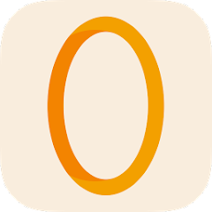
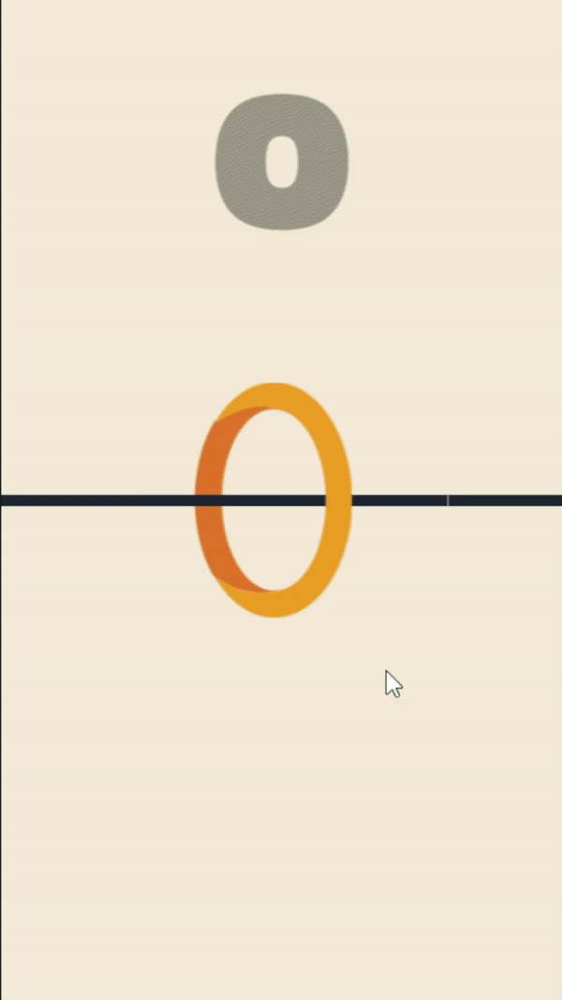

<h1 align="center"> Circle 2D Clone (Ketchapp) </h1>  

  

  This is project is clone of Circle 2D game with Unity developed by Ketchapp Game Studio.

 

 

## Gameplay

 

  

## Tools

Technologies I use in the game:

* New Input System
* Universal Render Pipeline (URP)

 

